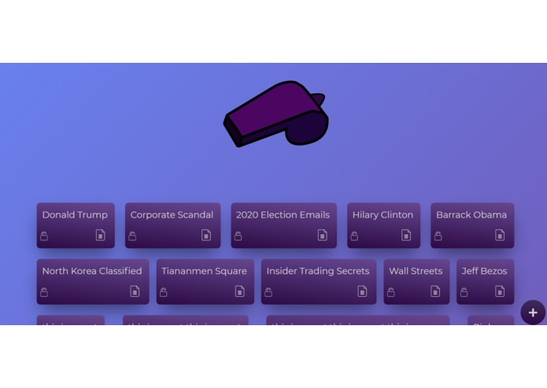
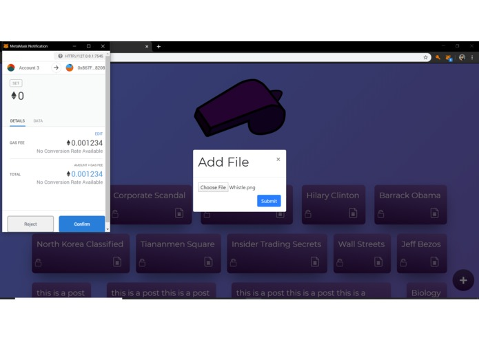

# Whistler | HackTheHammer II
At HackTheHammer II our group submitted this project and we won **Best Security Hack**.

## Inspiration
A few of us in our group had previously dappled with the realm of blockchain, and we wanted to further explore the power and potential that this technology brings to many world problems.

In the wake of American politics, most specifically the impeachment, the thought of whisteblowers and their security became a hot topic. Throughout past years, we have seen individuals who were threatened by the dangers that whistleblowing brings to the individual. That is what made us think "How can we use this technology and make a secure experience for whistleblowers?" The solution ended up as our project.

## What it does
Our project allows users to submit PDFs and other files associated with whisteblower complaints, over the blockchain, and place it up for review by accredited officials to verify the legitimacy of their complaint. It can then we approved, which then allows for public download through IPFS and viewing of the PDF across any platform. It is available in a feed format on the website. All posts, users, and moderators are completely anonymous, and all submissions are kept forever due to the nature of blockchain. Additionally, the system prevents fraud or abuse, such as through third party influence (think bots) and other manipulations of traditional media, due to the lack of a centralized server. The whole project is decentralized.

## How we built it
With 3 people, we delegated front end development to one person, and the back end / ethereum to the other two people. Our front end is build with React.js and many other React libraries such as react-spring, react-bootstrap, etc. We have a feed page where the user is able to upload a file to the forum and everyone can publicly view it. The file is then stored in a hash key which is accessible by everyone in the forum. People have the ability to lock or unlock each post on the application. We wanted to create a responsive, user-friendly GUI that would attract users to the website, and that's what we accomplished. The back end utilizes solidity and truffle to create smart contracts which stores information over the Ethereum block chain. We had users upload a file through the GUI and create a buffer which would then we stored with IPFS. We used Infura to interact with IPFS, due to it's value in development. Users use Metamask to make a transaction which would then take their image, hash it, then store the hash with the smart contract. This hash is then processed with our node server, then the client fetches the link for the hash and is able to display it.

## Challenges we ran into
Throughout this 24 hours competition our group encountered two main obstacles regarding our blockchain based project. The first is that we needed to create an IPFS Hash that was connected to our local Ethereum Blockchain and we didn't know how to do that. After troubleshooting for over 2 hours we finally got the Smart Wallet from MetaMask to connect to the local Blockchain hosted by Ganache. The second problem was creating a node server that was connected to our React Application and still made POST requests when you uploaded a file to the application. Even though this wasn't the hardest task at hand, no one in our group had experience with HTTPS requests so we read the documentation and learned it in under a hour. These challenges were only two of the many obstacles we faced during this 24 hours hackathon.

## Accomplishments that we're proud of
Our group is proud of connecting the Smart Wallet from MetaMask to the local Blockchain and actually storing the hashes in the blockchain. We were able to connect the Infura from the IPFS to the blockchain which was a major hurdle that we jumped over. We created an Express server that was working along with our React App which took a long time to finish. And finally, we were impressed that our frontend design was phenomenal and personally I think will attract many users to our web app.

## What we learned
Coming into this hackathon, our group had little to none experience in Blockchain but after reading some documentation for around two hours we smoothly transitioned from web apps to a simple Ethereum based Blockchain. We also continued to develop our React skills and Javascript during this hackathon, and also learned how to create an Express server that is compatible with our React App. Overall, our group and I took away many important concepts of Blockchain based apps during this hackathon.

## What's next for Whistler
Whistler is currently a local project on Github and didn't think of deploying it to the Internet so that it can be used from people around the world. So one aspect that we would like to add to Whistler is deploy it to Firebase and to add another thing is make the UI even more user friendly.

# Created by 

[Aditya Keerthi](https://github.com/Aditya-Keerthi) | [Daniel Yu](https://github.com/DanielYu2004) | [Markos Georghiades](https://github.com/Markos-The-G)
